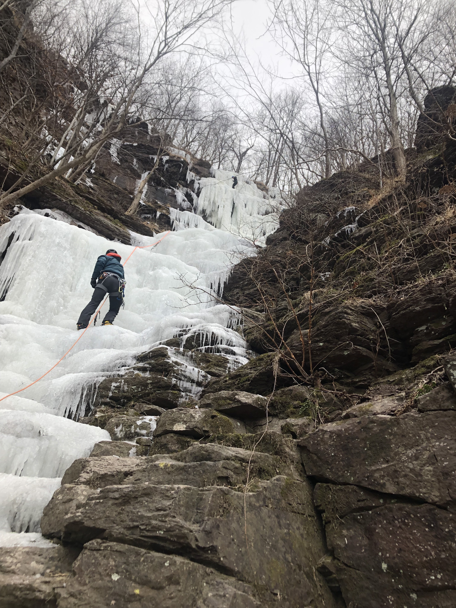

<h1>Ice Climbing in The Narrows</h1>

Near Kintersville, Pennsylvania, overlooking the Delaware River, is the best ice climbing in Pennsylvania: the Narrows. In this adapted exerpt from my notes (Vol 3, pgs 100-112), I tell the story of my first experience ice climbing: scaling a 350 foot waterfall called Dead Deer Gully. 

<figure>
  
  <figcaption>Jack follows up Dead Deer Gully</figcaption>
</figure>
